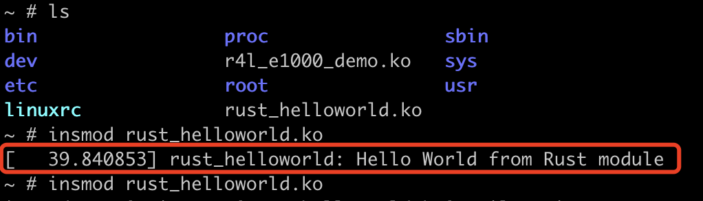

# 作业1

1. 生成内核编译配置文件

`make x86_64_defconfig` 命令用于生成默认的.config配置文件，该文件包含了所有用于编译内核的配置选项。


2. 配置内核编译选项，勾选Rust支持


3. 编译内核


# 作业2

## 实验过程

1. 编译生成内核模块文件


2. 默认的网卡驱动


3. 禁用默认网卡驱动并重新编译


4. 安装r4l_e1000_demo.ko并配置网络


## 问答

1. 编译成内核模块，是在哪个文件中以哪条语句定义的？

Makefile文件中的`$(MAKE) -C $(KDIR) M=$$PWD`

2. 该模块位于独立的文件夹内，却能编译成Linux内核模块，这叫做out-of-tree module，请分析它是如何与内核代码产生联系的？

在内核模块执行make命令后，Makefile中的`$(MAKE) -C $(KDIR) M=$(PWD)`命令会切换到内核源码目录，并使用内核源码目录中的 Makefile 编译由变量M指定的内核模块目录。内核构建系统会读取内核模块目录中的 Kbuild 文件，找到 `obj-m := r4l_e1000_demo.o` 定义，然后编译生成对应的.ko文件。

- obj-m 表示要编译生成的内核模块的目标文件。
- .ko 文件是kernel object file，由内核构建系统生成，它是可以加载到内核中的最终模块文件。内核模块可以在运行时动态加载到内核中，以扩展内核功能，而无需重新编译内核。

# 作业3

1. 修改samples/rust下的Kconfig文件，添加如下内容，增加一个菜单配置项

tristate 指定了这个配置选项可以有三种状态：y（编译进内核），m（编译成模块），n（不编译）。

```makefile
config SAMPLE_RUST_HELLO_WORLD
	tristate "Rust Hello World"
	help
	  This option builds the Rust Hello World module sample.

	  To compile this as a module, choose M here;
	  If unsure, say N.
```

2. 修改samples/rust下的Makefile文件，添加如下内容，指定内核模块编译后的对象文件

```makefile
obj-$(CONFIG_SAMPLE_RUST_HELLO_WORLD)           += rust_helloworld.o
```

3. 在linux目录下执行`make LLVM=1 menuconfig`，选中Rust Hello World模块。


4. 执行`make LLVM=1 -j$(nproc)`重新编译内核


5. 在qemu中安装该模块



# 作业4

ToDo

# 作业5

## 实验过程

1. 补充`samples/rust/rust_chrdev.rs`中的两个方法

```rust
 fn write(_this: &Self,_file: &file::File,_reader: &mut impl kernel::io_buffer::IoBufferReader,_offset:u64,) -> Result<usize> {
        let offset=_offset as usize;
        let mut dev=_this.inner.lock();
        // 避免字节长度超出字符设备
        let len=core::cmp::min(_reader.len(), dev.len().saturating_sub(offset));
        _reader.read_slice(&mut dev[offset..][..len]);
        Ok(len)
    }

    fn read(_this: &Self,_file: &file::File,_writer: &mut impl kernel::io_buffer::IoBufferWriter,_offset:u64,) -> Result<usize> {
        let offset=_offset as usize;
        let dev=_this.inner.lock();
        // 避免字节长度超出缓冲区
        let len = core::cmp::min(_writer.len(),dev.len().saturating_sub(offset));
        _writer.write_slice(&dev[offset..][..len])?;
        Ok(len)
    }
```

2. 重新编译内核并对字符设备做读写操作


## 问答

1. 作业5中的字符设备/dev/cicv是怎么创建的？它的设备号是多少？它是如何与我们写的字符设备驱动关联上的？

在`build_image.sh`中有一行命令：


- rcS 是系统初始化脚本文件之一，通常用于在系统启动过程中运行一系列初始化命令和脚本。

- mknod 命令用于创建设备文件，/dev/cicv是设备文件路径，c代表是一个字符设备，主设备号是248，次设备号是0。
- 设备号和设备驱动之间的关联关系会记录在设备驱动匹配表中。

# 项目实验

`002_completion`下C语言代码实现了一个字符设备驱动，与作业5的字符设备功能基本一致，因此可以复用作业5中的代码。

Rust重构的字符驱动模块代码见`r4l_experiment/driver/rust_completion`目录。

采用out-of-tree module编译模式，Kbuild和Makefile文件仿照作业2，见`r4l_experiment/driver/rust_completion`目录。

编译结果如下：


将`002_completion/load_module.sh`复制到`rust_completion`目录下。

运行QEMU，进入`/mnt/rust_completion`目录，执行`./load_module.sh load`加载驱动模块


另起一个终端，通过Telnet连接QEMU，一个读一个写，结果如下：


